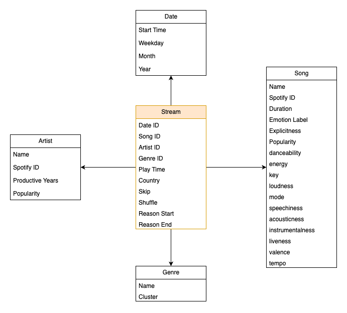

# UT Data Science 2022

Main project for the course Data Science implementing learned skill from DPV & DM.

Aim is to analyze the full streaming history of Spotify Users and gain insight on their musical taste and listening behavior.

For the analysis the extended spotify streaming history is required, which can be requested and downloaded from [Spotify](https://www.spotify.com/de/account/privacy/).

## Data Schema

